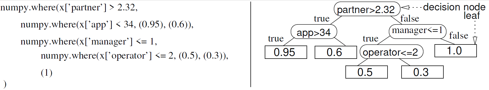

# **MGEDT**: Multiobjective Grammatical Evolution Decision Trees for classification tasks

## Overview
MGEDT is a novel **Multiobjective Optimization (MO)** approach to evolve **Decision Trees (DT)** using a **Grammatical Evolution (GE)**, under two main variants: a pure GE method (**MGEDT**) and a GE with Lamarckian Evolution (**MGEDTL**).
Both variants evolve variable-length DTs and perform a simultaneous optimization of the predictive performance (measured in terms of AUC) and model complexity (measured in terms of GE tree nodes). To handle big data, the GE methods include a **training sampling** and **parallelism evaluation mechanism**.
Both variants both use [PonyGE2](https://github.com/PonyGE/PonyGE2) as GE engine, while MGEDTL uses [sklearn DT](https://scikit-learn.org/stable/modules/generated/sklearn.tree.DecisionTreeClassifier.html).




More detais about this work can be found at: https://doi.org/10.1016/j.eswa.2020.114287.

# Install

**Using `pip`:**

```bash
pip install MGEDT
```

# Quick Start

This short tutorial contains a set of steps that will help you getting started with **MGEDT**.

## Load Example Data

